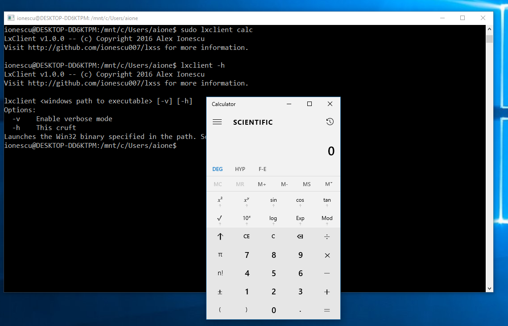
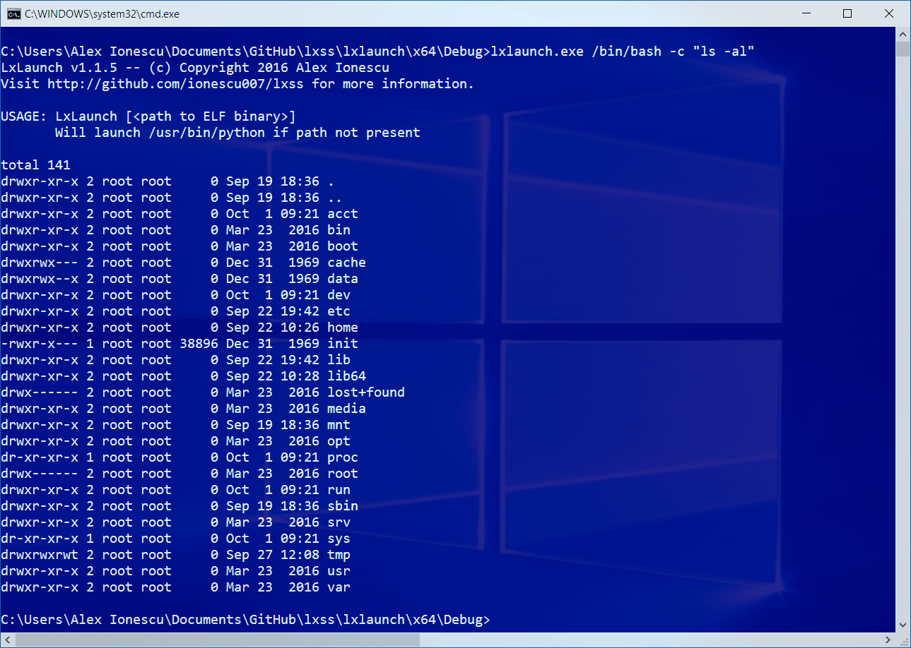

# lxss -- Fun with the Windows Subsystem for Linux (WSL/LXSS)

This repository is dedicated to research, code, and various studies of the Windows Subsystem for Linux, also known as Bash on Ubuntu on Windows, and LXSS. It contains a variety of Proof-of-Concept Win32 and Linux binaries, both in user-mode and kernel-mode, in order to interact with the various subsystem pieces. Namely, it demonstrates usage of the Win32 COM interface between Bash.exe and LxssManager, as well as of the ADSS Bus interface between init and LxssManager. For Redstone 2, it shows off some of the new interoperability features of the subsystem.

The PDF titled "The Linux Kernel hidden inside Windows 10" represents the BlackHat 2016 slides from my presentation, and a video is now available on Youtube at: https://www.youtube.com/watch?v=_p3RtkwstNk

If you would like to know more about my research or work, I invite you check out my blog at http://www.alex-ionescu.com as well as my training & consulting company (Winsider Seminars & Solutions Inc.,) at http://www.windows-internals.com.

## Screenshots





## LxLaunch
LxLaunch is a simple launcher which either launches /usr/bin/python if no parameters are given to it, or launches the given ELF executable if an argument is entered. The binary launches as a child of the init daemon, under the current/default Lx instance. Additional command-line arguments can be entered for the ELF process, and further command-line arguments can be nested in quotes if the ELF binary launches its own sub-binary with additional command-line options. For example:
```lxlaunch.exe /bin/bash -c "ls -al"```

## LxServer
LxServer is a simple Win32 (x64) server that waits for connections over the ADSS Bus from a compatible LXSS client (such as lxclient), and launches (WinExec) any input received as long as it fits within MAX_PATH. If needed, it configures the registry to enable ADSS Bus usage from root LXSS binaries other than the init daemon (see presentation slides), after which an initial reboot will be required. Launch it with -v for verbose information.

## LxClient
LxClient is a simple Linux (ELF) client that connects over the ADSS Bus to a compatible LXSS server (such as lxserver), and sends whatever the input command line argument is (which is expected to be a Win32 valid path to an executable, or other input that WinExec accepts) to the server. Launch it with -v following the Win32 path, for verbose information.

## LxExt
LxExt is an ld.preload extension for the init daemon, which creates a UNIX Domain socket /tmp/lxexec-socket and waits for connections. Once data is received, it passes it straight through the lxserver ADSS server on the Win32 side. This removes the need to have the Registry key set for ADSS Bus Access.

Finally, you will need add the following line into ```/etc/ld.so.preload``` to allow lxext.so to load:
``` /home/<username>/lxext.so``` making sure to replace <username> with your LX user name and running the editor as root.

## LxExec
LxExec is a client for LxExt. It connects to the UNIX Domain Socket and sends the input command line to it. This avoids needing to run as root, such as lxclient before. Simply run it as ```lxexec calc``` as an example, making sure that lxserver is running on the Win32 side.

## LxDrv
LxDrv is a driver for the RS2 (Redstone 2) build of WSL. It interacts with the new "Minor Device" APIs and registers a new minor device of ID 0xBAD, under the Major ID 10 which is for Miscelleanous devices under the Linux Device Tree (see devices.txt in Linux source). After registering the device, it then creates a /dev/lxdrv node and handles VFS open() commands toward it, creating a file, which can then receives IOCTLs. One such IOCTL is implemented for PoC purposes for the moment. The driver shows how to interact with the exported APIs within LxCore.sys. Note that because it takes over the functionality provided by Lxss.sys, it must never be unloaded if you have running instances, or if you plan to run further instances. Once loaded, it can only be unloaded if no instances are running, and must be re-loaded before running another instnace.

## LxDrvCli
LxDrvCli is a very simple ELF process to demonstrate opening the /dev/lxdrv node and sending it the 0xBEEF IOCTL, printing out the result.

## Lx
The Lx directory contains a number of WinDBG scripts to dump the current LX state. Copy them to your c:\lx directory, or create a directory symlink (mklink /d) to wherever you've copied them, then execute in WinDBG as follows: $$>< c:\lx\lx.wds
